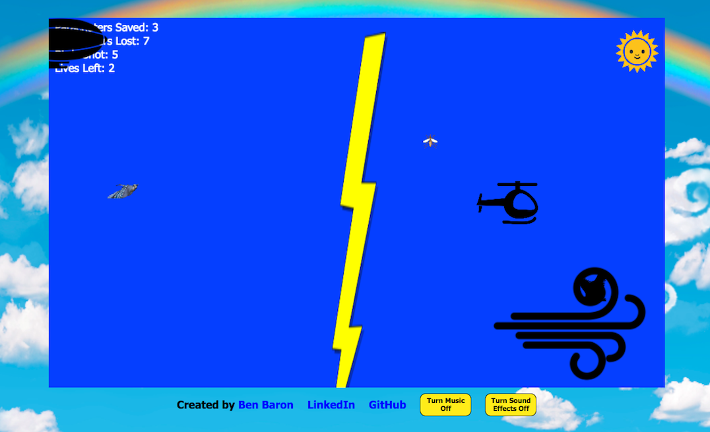

## Helicopter

[Live](http://www.benbaron.info/Helicopter/)
### Functionality

Player guides the helicopter using the arrow keys to rescue falling parachuters and fires arrows using spacebar to defend against attackers.

- [ ] Game displays the number of lives left, parachuters rescued and lost, and birds destroyed.
- [ ] Objects change image upon collision, such as the bird turning to feathers.
- [ ] Arrows destroy birds and mosquitos, but also kill parachuters.
- [ ] The helicopter is destroyed by leaving the game view or running into other objects, except for parachuters, clouds and sun.
- [ ] Wind affects other object's speed and direction.
- [ ] Parachuters fall faster as the rescue count increases.
- [ ] Birds fly faster as the birds destroyed count increases.
- [ ] Game can be paused and music and sound individually toggled.
- [ ] Infinite arrow hack is available by typing in password "vern" immediately after beginning a new game.

### Architecture and Technologies

This project is implemented using vanilla JavaScript, HTML5 with Canvas, and CSS3.

Each object has its own class, which will interact with other objects based upon its own unique specifications.

